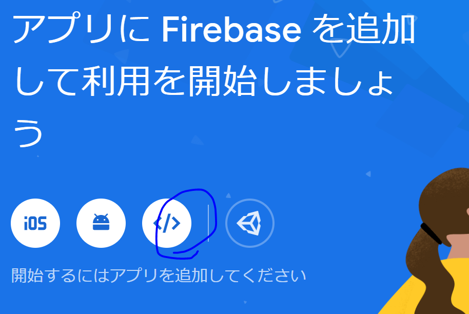
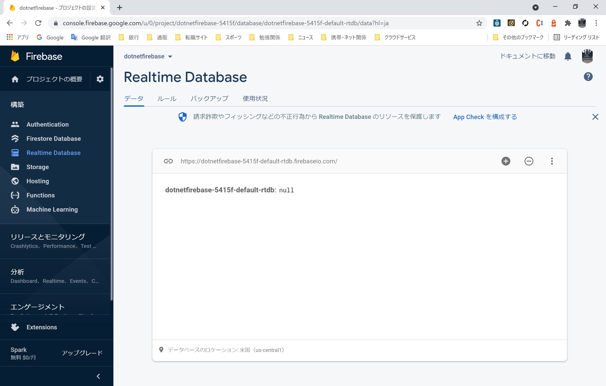
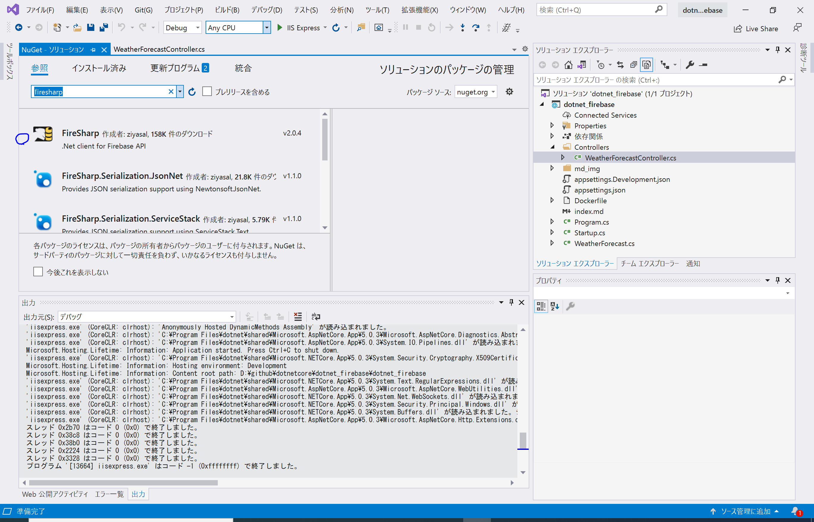
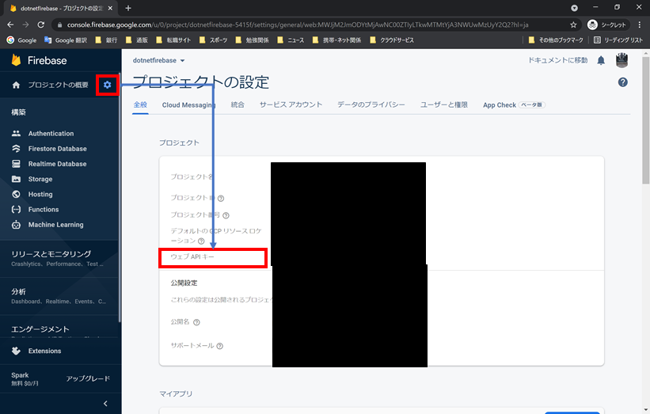
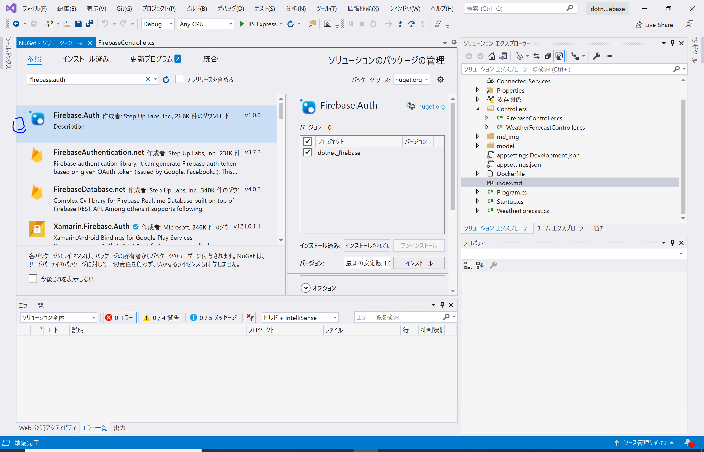
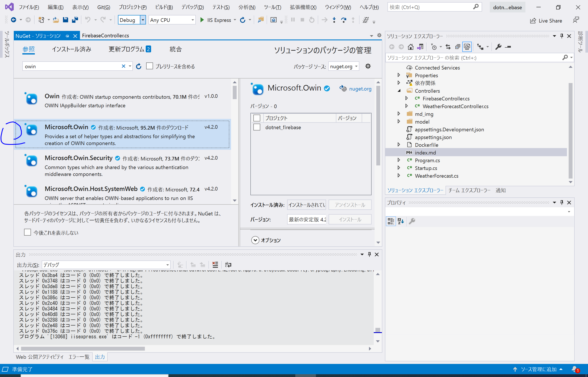
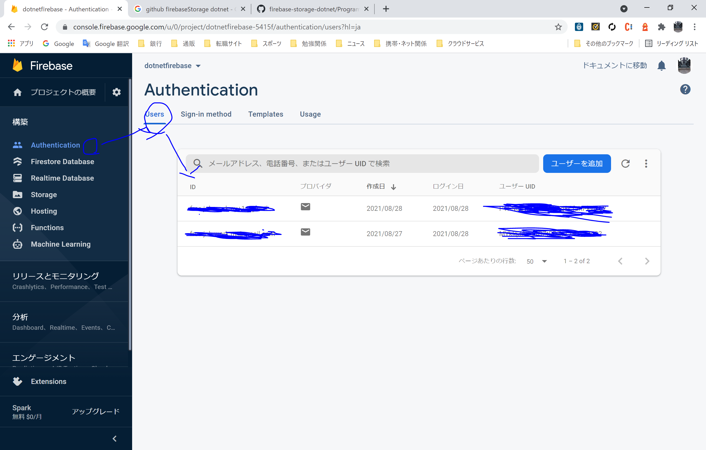
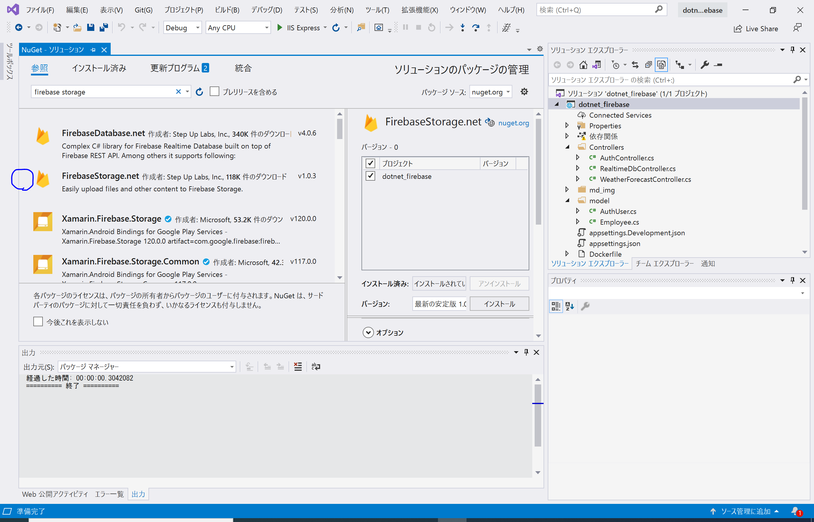
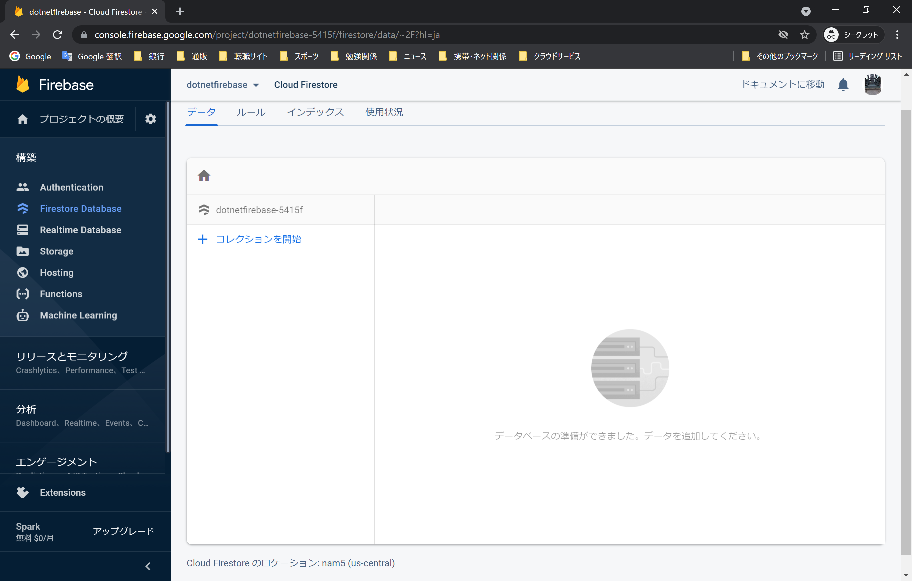

## realtime database

### firebase

1. https://firebase.google.com/?hl=ja
2. プロジェクト作成
   1. name : dotnetfirebase
   2. Google analytics invalid
3. WebApp を選択
   

   1. appname : test-fire
   2. Firebase SDK javascript

      ```javascript
       <!-- The core Firebase JS SDK is always required and must be listed first -->
       <script src="https://www.gstatic.com/firebasejs/8.10.0/firebase-app.js"></script>

       <!-- TODO: Add SDKs for Firebase products that you want to use
           https://firebase.google.com/docs/web/setup#available-libraries -->

       <script>
       // Your web app's Firebase configuration
       var firebaseConfig = {
           apiKey: "**************************",
           authDomain: "xxxxxxxxxx.firebaseapp.com",
           projectId: "xxxxxxxxxx",
           storageBucket: "xxxxxxxxxx.appspot.com",
           messagingSenderId: "yyyyyyyyyyyyyyy",
           appId: "1:yyyyyyyyyyyyyyy:web:d003cba114682adf648d79"
       };
       // Initialize Firebase
       firebase.initializeApp(firebaseConfig);
       </script>
      ```

4. RealTime DataBase

   1. データベース作成
      1. リージョン：米国
      2. テストモード
   2. 接続 URL
      1. https://xxxxxxxxxx-default-rtdb.firebaseio.com/
         

5. プロジェクト設定
   1. サービスアカウント
      1. DataBase Secrets
         1. 接続に必要なシークレット ID が設定されている
            

### visual studio

#### nuget

- fireSharp
  

## Authentication

### firebase

WEBKEY を使用します。


### visual studio

#### nuget

- firebase.Auth
  

メモ 使用しないけど

- Microsoft.Owin -version 4.1.0
  

  command

  ```bash
   PM> Install-Package Microsoft.Owin -Version 4.1.0
  ```

- Microsoft.AspNet.Identit
  command

  ```bash
   PM> Install-Package Microsoft.AspNet.Identit -Version 2.2.3
  ```

## Storage

### firebase

- ログインユーザーは下記を使用します
  

### nuget

- firebaseStorage
  

### github

https://github.com/step-up-labs/firebase-storage-dotnet

## Store DataBase

### firebase

- Create DataBase
  1.  データベース作成
  2.  テストモード（本番でも可能、）
  3.  ロケーション任意選択後、有効
      
- serviceAccountKey
  1. プロジェクト設定
  2. サービスアカウント
  3. Firebase Admin SDK
     1. 新しい秘密鍵の生成

### visual studio

- google fire documetn
  https://cloud.google.com/dotnet/docs/reference/Google.Cloud.Firestore/latest/index

- Google.Cloud.Firestore
  
